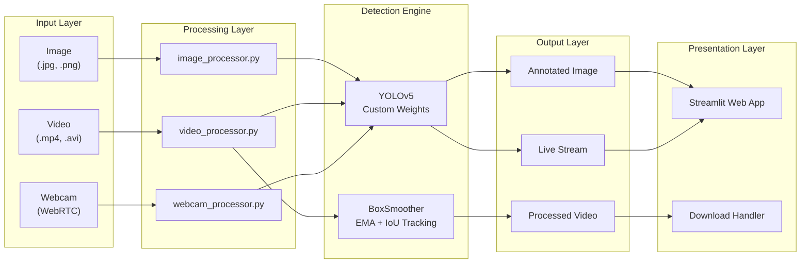
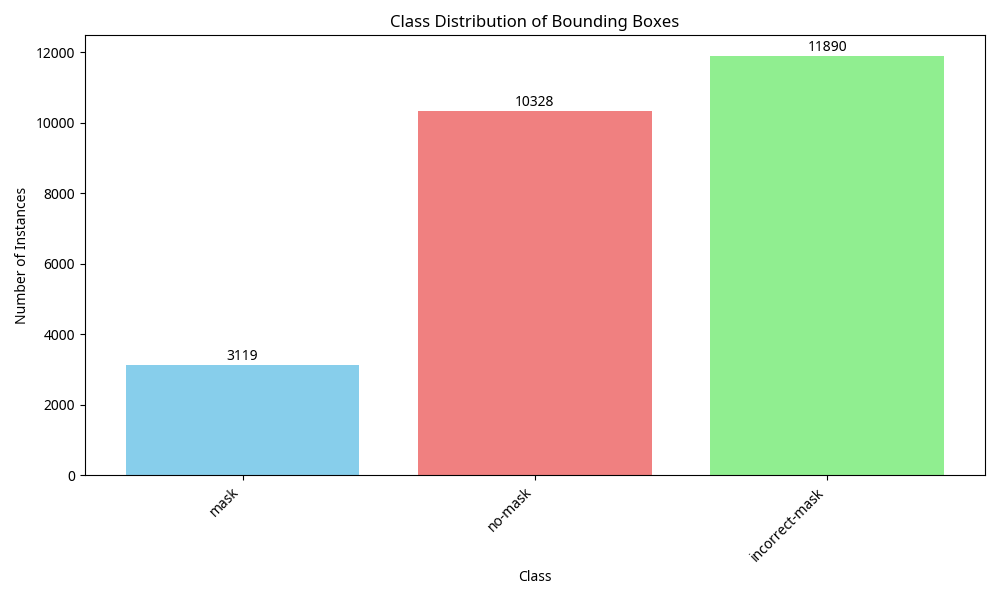
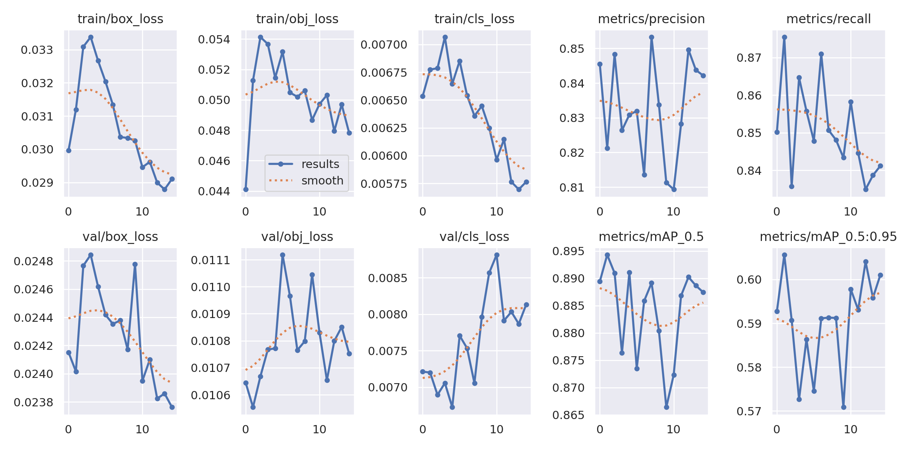
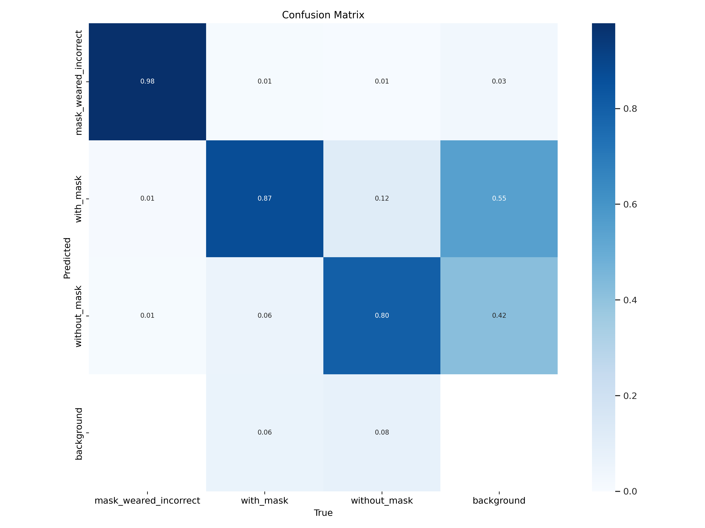

# Face Mask Detection System


Real-time face mask detection achieving **89.4% mAP@0.5** using a custom-trained YOLOv5 model on 8,000+ images, with image/video/webcam processing modes and temporal bounding box smoothing.

## Problem Statement

Manual mask compliance monitoring in crowded spaces (offices, retail, transit) is error-prone and doesn't scale. Security staff miss violations, footage review is tedious, and there's no automated way to generate compliance reports or trigger real-time alerts.

## Solution Overview

This system accepts images, videos, or live webcam feeds, runs YOLOv5 inference to classify faces into three mask states, applies IoU-based tracking with EMA smoothing to eliminate bounding box jitter, and displays results through an interactive Streamlit UI with one-click video download.

## Architecture Diagram



## Architecture Explanation

| Module                     | File                        | Responsibility                                                                                                |
| -------------------------- | --------------------------- | ------------------------------------------------------------------------------------------------------------- |
| **Model Layer**      | `src/models.py`           | Loads YOLOv5 weights via PyTorch Hub with Windows compatibility fixes; uses Streamlit resource caching        |
| **Image Processor**  | `src/image_processor.py`  | Single-frame inference—upload → detection → bounding box overlay → annotated image                        |
| **Video Processor**  | `src/video_processor.py`  | Frame-by-frame detection with `BoxSmoother` class (EMA/moving-average/hybrid) and IoU-based object tracking |
| **Webcam Processor** | `src/webcam_processor.py` | Real-time detection via `streamlit-webrtc` WebRTC streaming                                                 |
| **UI Components**    | `src/ui_components.py`    | Centralized CSS styling and reusable UI elements                                                              |
| **Configuration**    | `utils/config.py`         | Single source of truth for thresholds, colors, codec preferences                                              |

## Engineering Decisions

| Decision                                | Rationale                                                                                                                      |
| --------------------------------------- | ------------------------------------------------------------------------------------------------------------------------------ |
| **YOLOv5 over YOLOv8**            | Mature ecosystem, stable PyTorch Hub loading, extensive community support; YOLOv8 had import issues during development         |
| **Custom dataset (8,065 images)** | Combined 5 public datasets to improve class balance and diversity; single datasets had insufficient `incorrect_mask` samples |
| **896×896 input resolution**     | Higher than default 640 improves small face detection; balanced against inference speed                                        |
| **EMA smoothing (α=0.6)**        | Simpler than Kalman filters, sufficient for bounding box stabilization without state explosion                                 |
| **IoU-based tracking**            | Lightweight object association without DeepSORT/ByteTrack complexity; works well for static camera scenarios                   |
| **40% confidence threshold**      | Empirically tuned to balance false positives vs missed detections                                                              |
| **Label smoothing (0.1)**         | Reduces overconfidence during training, improves generalization                                                                |
| **Freeze first 10 layers**        | Transfer learning from COCO pretrained weights; only fine-tune detection head                                                  |

## Model Training Details

### Dataset Composition

The model was trained on a custom combined dataset created by merging 5 public face mask datasets:

| Source                                                                                                                           | Original Format | Images | Classes |
| -------------------------------------------------------------------------------------------------------------------------------- | --------------- | ------ | ------- |
| [Roboflow Real-time Face Mask](https://universe.roboflow.com/group-tbd/real-time-face-mask-detection-and-validation-system-dataset) | YOLOv5 PyTorch  | ~3,000 | 3       |
| [Kaggle Face Mask Detection](https://www.kaggle.com/datasets/andrewmvd/face-mask-detection)                                         | PASCAL VOC      | ~850   | 3       |
| [Kaggle Face Mask YOLO Format](https://www.kaggle.com/datasets/aditya276/face-mask-dataset-yolo-format)                             | YOLO            | ~1,500 | 2       |
| [Kaggle Labeled Mask YOLO_darknet](https://www.kaggle.com/datasets/techzizou/labeled-mask-dataset-yolo-darknet)                     | YOLO            | ~1,200 | 2       |
| [GitHub MINED30 Face Mask](https://github.com/MINED30/Face_Mask_Detection_YOLO)                                                     | YOLO            | ~1,500 | 3       |

**Final Dataset Statistics:**

| Split           | Images          | Annotations      |
| --------------- | --------------- | ---------------- |
| Train           | 7,323           | —               |
| Val             | 437             | —               |
| Test            | 305             | —               |
| **Total** | **8,065** | **25,337** |

### Class Distribution



| Class                     | Annotations | Percentage |
| ------------------------- | ----------- | ---------- |
| `mask_weared_incorrect` | 3,119       | 12.31%     |
| `with_mask`             | 10,328      | 40.76%     |
| `without_mask`          | 11,890      | 46.93%     |

### Training Configuration

```yaml
# Hyperparameters
epochs: 15
batch_size: 8
imgsz: 896
optimizer: SGD
lr0: 0.01
momentum: 0.937
weight_decay: 0.0005

# Augmentations
mosaic: 1.0
mixup: 0.1
copy_paste: 0.1
hsv_h: 0.015
hsv_s: 0.7
hsv_v: 0.4
fliplr: 0.5

# Regularization
label_smoothing: 0.1
freeze: [0-10]  # Transfer learning
cos_lr: true    # Cosine LR scheduler
```

### Training Results



| Metric                 | Value |
| ---------------------- | ----- |
| **mAP@0.5**      | 89.4% |
| **mAP@0.5:0.95** | 60.1% |
| **Precision**    | 84.2% |
| **Recall**       | 84.1% |

### Precision-Recall Curve


### Confusion Matrix



## Key Features

- **Three-class detection**: Correctly masked, incorrectly masked (nose exposed, chin mask), and unmasked faces
- **Temporal smoothing**: EMA-based bounding box stabilization eliminates frame-to-frame jitter in videos
- **Real-time webcam**: Browser-based WebRTC streaming with live overlay
- **One-click export**: Download processed videos with all detections rendered
- **Responsive UI**: Modern Streamlit interface with progress tracking

## Tech Stack (With Purpose)

| Tool                       | Purpose                                                                |
| -------------------------- | ---------------------------------------------------------------------- |
| **Python 3.8+**      | Runtime with async support for video processing                        |
| **PyTorch + YOLOv5** | Object detection backbone; custom weights via `torch.hub`            |
| **OpenCV**           | Frame extraction, video encoding (H.264/XVID), bounding box rendering  |
| **Streamlit**        | Web UI framework—rapid ML app deployment without frontend code        |
| **streamlit-webrtc** | WebRTC integration for browser-based camera access                     |
| **NumPy**            | Efficient array operations for IoU calculations and frame manipulation |
| **Pillow**           | Image format handling for uploads                                      |

## Input/Output Specification

### Input Formats

| Mode   | Formats                       | Notes                                  |
| ------ | ----------------------------- | -------------------------------------- |
| Image  | `.jpg`, `.jpeg`, `.png` | Single-frame detection                 |
| Video  | `.mp4`, `.avi`, `.mov`  | Up to 100MB; frame-by-frame processing |
| Webcam | Browser stream                | Real-time via WebRTC                   |

### Output

| Mode   | Output                                                                  |
| ------ | ----------------------------------------------------------------------- |
| Image  | Annotated image with colored bounding boxes and confidence scores       |
| Video  | Downloadable `.mp4` with smooth, temporally-consistent bounding boxes |
| Webcam | Live overlay in browser window                                          |

### Detection Classes

```
with_mask          → Green bounding box   (correctly worn)
without_mask       → Red bounding box     (no mask)
mask_weared_incorrect → Blue bounding box (nose/chin exposed)
```

## Installation

### Prerequisites

- Python 3.8+
- Git

### Setup

```bash
# Clone repository
git clone https://github.com/siddharth-narigra/face-mask-detection.git
cd face-mask-detection

# Create virtual environment
python -m venv venv
venv\Scripts\activate        # Windows
source venv/bin/activate     # macOS/Linux

# Install dependencies
pip install -r requirements.txt
```

### Model Weights

Place trained YOLOv5 weights at `weights/best.pt`.

> **Note**: The weights file is not included in the repository due to size. Contact the author or train your own model using the dataset sources listed above.

## How to Run

```bash
# Start the Streamlit app
streamlit run app.py
```

The app opens at `http://localhost:8501` with three tabs:

- **Image Upload**: Drag-and-drop image analysis
- **Webcam Detection**: Real-time camera detection
- **Video Processing**: Upload and process video files

## Folder Structure

```
face-mask-detection/
├── app.py                    # Main Streamlit entry point
├── requirements.txt          # Python dependencies
├── LICENSE                   # MIT License
├── README.md                 # This document
├── assets/                   # Training visualizations
│   ├── confusion_matrix.png
│   ├── training_results.png
│   ├── PR_curve.png
│   ├── F1_curve.png
│   └── class_distribution.png
├── src/
│   ├── __init__.py
│   ├── models.py             # YOLOv5 loading with caching
│   ├── image_processor.py    # Single-image detection
│   ├── video_processor.py    # Video processing + box smoothing
│   ├── webcam_processor.py   # WebRTC real-time detection
│   └── ui_components.py      # Shared CSS and UI elements
├── utils/
│   ├── __init__.py
│   ├── config.py             # Centralized configuration
│   └── logger.py             # Logging utilities
├── tests/
│   ├── __init__.py
│   ├── test_models.py
│   └── test_video_processor.py
└── weights/
    └── README.md             # Instructions to obtain weights
```

## Limitations

- **Lighting sensitivity**: Detection accuracy degrades in low-light or high-contrast conditions
- **Occlusion handling**: Partially visible faces (hand covering, extreme angles) may be missed
- **Small faces**: Distant subjects or low-resolution inputs reduce confidence
- **Class imbalance**: `incorrect_mask` class has fewer training samples (12.31%), affecting detection of edge cases
- **Static camera assumption**: IoU tracking works best when camera is stationary; fast motion causes ID switches
- **No persistent identity**: Objects matched frame-by-frame by IoU, not re-identification
- **CPU inference**: Slower on CPU; GPU recommended for real-time video processing

## Future Improvements

- [ ] Add confidence threshold slider in UI for real-time tuning
- [ ] Implement DeepSORT for persistent person tracking across frames
- [ ] Export detection logs to CSV/JSON for compliance reporting
- [ ] Add audio/visual alerts when unmasked face detected
- [ ] Dockerize for one-command deployment
- [ ] Benchmark FPS across different hardware configurations
- [ ] Train on additional `incorrect_mask` samples to improve minority class performance

## License

[MIT License](LICENSE)

## Acknowledgments

- [Ultralytics YOLOv5](https://github.com/ultralytics/yolov5) for the detection framework
- Dataset contributors on Roboflow, Kaggle, and GitHub
